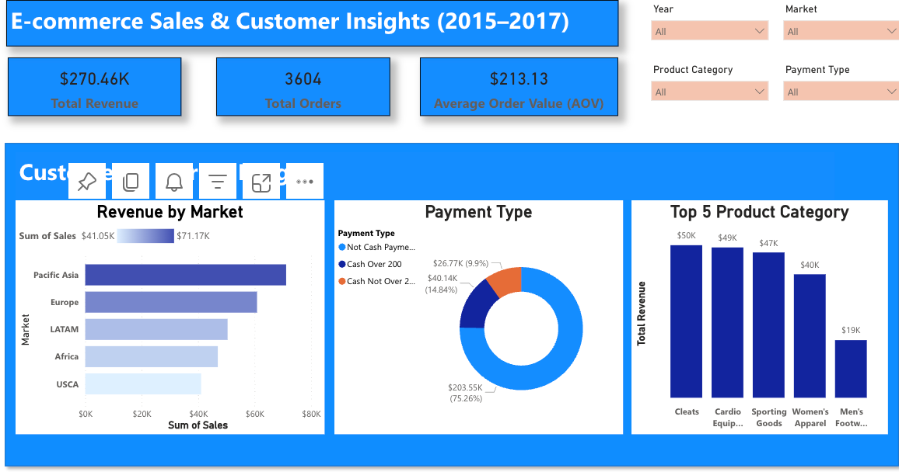
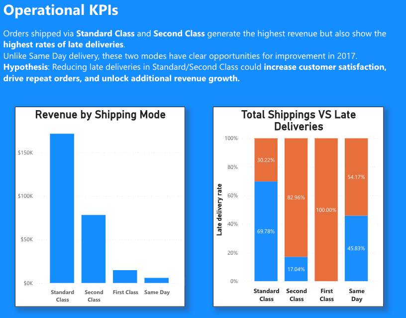

# excel-ecommerce-data

# 🛒 Customer & Sales Data Cleaning, Transformation, and Analysis in Excel

## 📌 Overview

This project demonstrates how I cleaned, transformed, and analysed raw e-commerce sales, product, and customer data using Excel.  

The objective was to prepare a clean, structured dataset that enables business insights on customers, products, sales trends, and delivery performance.

The final file includes:
* Cleaned and standardised customer and product records
* Derived columns for analysis (addresses, delivery dates, payment flags)
* PivotTables summarising sales performance
* Business insights relevant to marketing, product management, and operations
* Visualisations in Power BI

---

## 🔄 Process & Steps

### 1. Data Import & Preparation

* Imported multiple raw files: Orders.xlsx, Products.csv, Customers.txt.
* Converted formatted tables into ranges for easier manipulation.
* Standardised headers, applied filters, resized columns.

**Before**:

**After**:

### 2. Data cleaning

* Removed duplicates in Customers & Products to ensure unique IDs
* Combined first/last names into a Full Name column
* Created a Customer Address field (Street, City, ZIP) for segmentation
* Standardised states/countries (EE.UU. → USA)
* Applied TRIM() to clean trailing spaces in state codes

**Deduping**:

  

**Concatenating**:

---

### 3. Data Transformation & Enrichment 

Functions used: IFs, nested IFs, VLOOKUPs, WEEKDAY, TODAY, etc.

* Added to the Order sheet information about Product Category, Product Name and Day of Week, when the order was made, using the VLOOKUPs. They will be useful in future analysis and Pivot Tables.

* Added derived columns in Orders:
    Scheduled Delivery Date (calculated from shipping days),
    On-Time Priority Deliveries flag,
    Order Total Sales (corrected sales after discounts),
    Cash Payments categories (Cash Over 200, Cash Not Over 200, Non-Cash).

* Protected the final Customers sheet to preserve master data integrity

---

### 4. Analysis with Pivot Tables

Created PivotTables to answer key business questions:

* Orders by Market – total orders & quantities by region
* Average Quantity per Order per Market – operational KPI
  

* Sales by Day of Week – identified peak sales days (Saturday; Week starts from Sunday)
* Sales by Product Category – revealed top categories driving revenue

* Payments Breakdown – % of orders by payment type

---
## 📊 Business Insights with visualisations in Power BI

After data cleaning, the data was uploaded to Power BI. Additional metrics and columns for filtering were created using DAX.
A general overview dashboard with high-level metrics for C-level stakeholders was prepared, with the ability to filter by year, market, product category, and payment type, covering the following KPIs:

Total Revenue
Total Orders
Average Order Value

Overall, APAC and Europe are the main revenue drivers.

Cash orders over $200 make up approximately 10% of transactions and around 11% of total revenue. This is worth highlighting for finance and risk teams, as it may warrant closer monitoring or policy review.

Cleats, Cardio Equipment, Women's Apparel drive a large share of revenue across all regions, making them key focus categories for product strategy. In Europe (see the pivot table above), Sports Equipment is also an important driver of revenue, particularly on Saturdays.

Same-Day Shipping achieves a 100% on-time delivery rate, while Standard delivery stands at 70% and Second Class at only 17%. The majority of revenue is driven by Standard and Second Class delivery orders. Therefore, improving the reliability of these delivery types could potentially drive higher revenue and reduce order cancellations, though this remains a hypothesis as no cancellation data is available in this dataset.

## 🛠 Excel Skills Demonstrated
| **Category**                        | **Skills Demonstrated**                                                                                                                                                                           |
| ----------------------------------- | ------------------------------------------------------------------------------------------------------------------------------------------------------------------------------------------------- |
| **Data Import & Preparation**       | Import from Excel & text/CSV files · Sheet structuring · Filters · Column formatting & auto-sizing                                                                                                |
| **Data Cleaning**                   | Remove duplicates · Flash Fill (Full Name) · TRIM() & LEN() for text cleanup · Find & Replace (country names) · Consolidated fields (Customer Address) · Convert formulas to values               |
| **Lookup & Relational Data**        | VLOOKUP / INDEX-MATCH · Linking Orders, Customers, Products, and Dates · Pulling Product Name & Category                                                                                          |
| **Date & Time Handling**            | Created Dates table with Fill Series · Weekday extraction · Scheduled Delivery Date calculation (weekday-only logic)                                                                              |
| **Logical & Conditional Functions** | IF() · AND() · NOT() · Nested IF() (Cash Payments) · Business flags (Expensive Product, On-Time Delivery, Payment Segmentation)                                                                   |
| **Formatting & Validation**         | Currency & Date formatting · Conditional formatting (duplicates, outliers) · Worksheet protection (passwords, locked/unlocked cells)                                                              |
| **PivotTables & Aggregations**      | PivotTables for Market Orders, Avg. Quantity per Order, Sales by Weekday, Category Sales (Saturday filter), Payment Method analysis (% of total) · Calculated fields (averages & % contributions) |
| **Business Metrics (KPIs)**         | Average Product Price · Expensive Product flag · Order Total Sales (factoring discounts) · Market-level performance · Customer & Payment segmentation                                             |

---

## 📁 Files in This Repository

before/ – contains sample raw input files

cleaned-data-ecommerce.xlsx – final cleaned dataset with PivotTables

screenshots/ – images of before/after data cleaning and analysis views

README.md – project documentation (this file)
